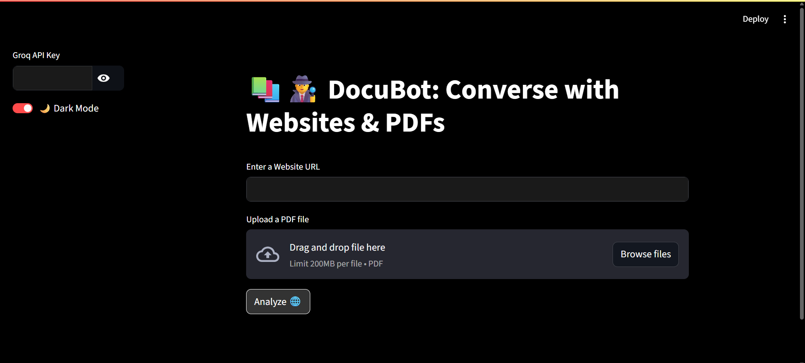

# 🧠 DocuBot — Chat with PDFs and Websites using LLMs

**DocuBot** is a conversational assistant that lets you interact with any **PDF document** or **website** using natural language. Just upload a PDF or enter a URL, and DocuBot will read, process, and answer your questions — powered by **LLaMA 4 (via Groq)** and **LangChain**.



---

## 🚀 Features

- 📄 Upload and chat with **PDF documents**
- 🌐 Enter a **website URL** and extract answers
- 🧠 Uses **Meta LLaMA-4-Scout (17B)** via **Groq API**
- 🔎 Embeds content using **HuggingFace embeddings**
- 🗂️ Fast retrieval with **FAISS vector store**
- 🖥️ Clean, modern **Streamlit UI**
- 🌙 Light/Dark theme toggle
- 💾 Remembers current session, avoids reprocessing
- 🛡️ Error handling and safe parsing included

---

## 🛠️ Tech Stack

| Tool              | Purpose                            |
|-------------------|------------------------------------|
| Python 3.10+       | Programming language               |
| Streamlit          | Web app UI                        |
| LangChain          | Chaining + document loaders       |
| HuggingFace        | Embeddings                        |
| FAISS              | Vector similarity search          |
| Groq               | Access to LLaMA 4 model           |
| PyMuPDF            | PDF parsing                       |
| BeautifulSoup4     | HTML scraping from websites       |

---

## 📦 Installation

1. **Clone the repository**
   ```bash
   git clone https://github.com/himikajain15/DocuBot.git
   cd DocuBot
2. **Install dependencies**
  ```bash
  pip install -r requirements.txt

3. **Run the app**

  ```bash
  streamlit run app.py
**Get your Groq API Key**
To use the LLaMA 4 model, you need a Groq API key.
👉 Get it for free at https://console.groq.com/keys
