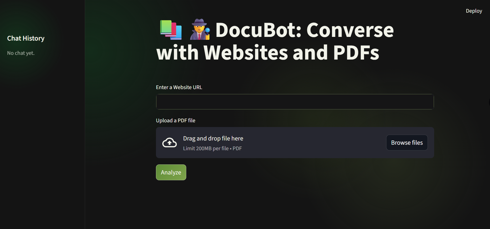

# 🧠 DocuBot — Chat with PDFs and Websites using LLMs

DocuBot is an interactive AI assistant that allows you to ask questions about **PDF documents** and **web pages** using powerful **Groq-hosted LLaMA-4** models. It parses text from files or URLs, embeds the content using **HuggingFace embeddings**, stores it in a **FAISS vector database**, and answers your queries in real time via an intuitive **Streamlit** UI.

---

## 🚀 Features

- 📄 Upload and query **PDF documents**
- 🌐 Enter any **website URL** and ask questions
- 🧠 Powered by **Meta-LLaMA 4-Scout** model via Groq
- 🧩 Chunking and embedding via **LangChain** and **HuggingFace**
- 📦 Vector storage and similarity search using **FAISS**
- 🖥️ Beautiful and dynamic **Streamlit interface**
- 💾 Session state and error handling built-in

---

## 🛠️ Tech Stack

- **Python 3.10+**
- **Streamlit** – Frontend and user interaction
- **LangChain** – Document loading, chaining, embedding
- **HuggingFace Transformers** – Embeddings
- **FAISS** – Vector similarity search
- **Groq API** – For Meta-LLaMA 4 model
- **BeautifulSoup4** – Web scraping
- **PyMuPDF** – PDF parsing

---

## 📸 Demo



---

## ⚙️ Installation

```bash
git clone https://github.com/himikajain15/DocuBot.git
cd DocuBot
pip install -r requirements.txt
