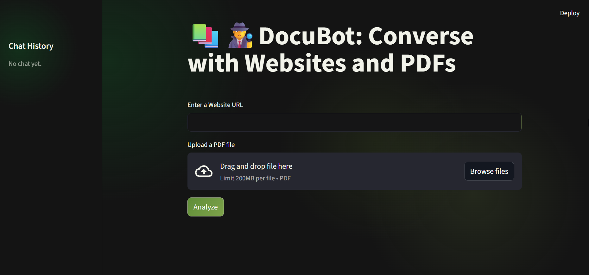

# DocuBot

DocuBot is a Streamlit app for chatting with website content and PDF files using Groq and LangChain.



## Features

- Chat with a website by pasting its URL
- Upload a PDF and ask questions about it
- Groq-powered answers with retrieval over the loaded content
- Sidebar chat history
- Streamlit secrets support for `GROQ_API_KEY`

## Run locally

```bash
pip install -r requirements.txt
streamlit run DocuBot.py
```

## Streamlit secrets

The app uses the Groq API key from Streamlit secrets, so users do not need to enter a key in the UI.

Before deployment, add this in `.streamlit/secrets.toml` locally or in Streamlit Community Cloud secrets:

```toml
GROQ_API_KEY = "your_groq_api_key_here"
```

## Deploy on Streamlit Community Cloud

1. Push this repo to GitHub.
2. Create a new app in Streamlit Community Cloud.
3. Select this repository and branch.
4. Set the main file path to `DocuBot.py`.
5. Add `GROQ_API_KEY` in app secrets, and users can use the app without entering their own key.

## Project files

- `DocuBot.py` - main Streamlit app
- `requirements.txt` - Python dependencies
- `.streamlit/secrets.toml.example` - sample secrets file
- `screenshot.png` - app preview
